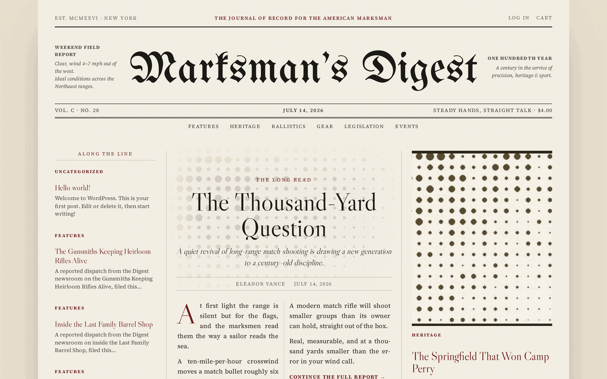

# Broadside

**A broadsheet block theme for WordPress.** A blackletter nameplate, a folio rule,
a three-column lead grid, and the editorial furniture a long read actually needs.

<p align="center">
  
</p>

<p align="center">
  <em>One theme. Two live publications. Byte-identical code.</em><br>
  <a href="https://cannabisdigest.net">cannabisdigest.net</a> · <a href="https://marksmansdigest.com">marksmansdigest.com</a>
</p>

---

Broadside dresses a WordPress site as a newspaper — not with a picture of one, but
with its typography. The front page is a real broadsheet lead grid: a rail of
briefs, a lead story set in two justified columns with a drop cap that falls on
the first paragraph, and a photograph with the day's secondary story beside it.
Above it sits a blackletter nameplate flanked by two "ears", and a folio rule
carrying the volume in Roman numerals, the date, the motto and the cover price.

Everything above is stock WordPress. No page builder, no plugin, no build step.

## What makes it different

**It is one theme, and it is two entirely different newspapers.** No brand name,
colour, year, city or section list is hard-coded anywhere in it. The accent, the
founding year, the city of record, the strapline, the motto, the cover price, the
volume, the ears and the newsletter's name are Customizer settings. Two sites run
this code and one is a green cannabis trade weekly while the other is an oxblood
shooting-sports monthly. Same bytes.

**It knows what an article is.** Seventeen blocks of editorial furniture — a Short
Answer for the reader in a hurry, Key Takeaways, a Table of Contents that builds
itself from your headings, an FAQ that emits `FAQPage` structured data, Sources &
References, a Disclosure Table whose partner links are always `rel="sponsored
nofollow"`, and the Byline / Author Bio / Editorial Standards trust signals a
journal of record is judged on.

**It gets out of the way.** Broadside emits `NewsArticle`, `Organization`,
`BreadcrumbList` and `FAQPage` schema — but goes silent the moment Yoast, Rank
Math, SEOPress or All in One SEO is active, because two competing graphs on one
page is worse than none. It renders a newsletter form and posts it to an endpoint
you name; it **stores no subscribers and sends no mail**, because your list is
yours and a theme that held it would lose it the day you switched themes.

## The rule this codebase is built around

> **Nothing in this theme may render post content.**

On 2026-07-13, a block render callback called `do_blocks()` on the post content to
find its headings. That re-renders every block in that content — *including the
block that called it* — with no base case. Requests spun forever, hung every
PHP-FPM worker on a shared box, and starved it until it could not fork `sshd`. It
took down a live firearms marketplace that had nothing to do with this theme, for
about forty minutes.

The full account is in **[`docs/INCIDENT-2026-07-13-vps-outage.md`](docs/INCIDENT-2026-07-13-vps-outage.md)**.
It is short and it is not padded. The three rules it produced:

1. **Never render post content in a render callback.** No `do_blocks()`, no
   `apply_filters( 'the_content', … )`. Read the **raw** `post_content` — a
   `core/heading` block saves its `<h2>` verbatim, so the HTML is already there.
   [`scripts/guard-no-content-render.php`](scripts/guard-no-content-render.php)
   tokenizes every PHP file and fails the build if it comes back. CI runs it;
   `deploy.sh` runs the same script, so the two cannot drift.
2. **Nothing deploys that has not rendered locally first.** The theme was
   originally shipped to two live sites having never been executed anywhere.
   `./scripts/local-wp.sh up` builds a throwaway WordPress in seconds.
3. **A green test suite is evidence, not proof. Look at the page.** Three separate
   bugs that day passed every automated check and were caught only by a human
   reading the rendered HTML.

The sandbox runs with `max_execution_time=10`, so a runaway recursion dies in ten
seconds with a stack trace instead of eating a machine. That is deliberate.

## Working on it

```bash
./scripts/local-wp.sh up          # throwaway WordPress on :8080, admin/admin
./scripts/local-smoke.sh          # every template renders, fast, no fatals
php scripts/local-assert.php      # the pages are CORRECT (36 assertions)
./scripts/shoot.sh                # screenshot every route, desktop + mobile
./scripts/deploy.sh <site>        # gated deploy to ONE site
```

`deploy.sh` will not deploy unless all five gates pass:

| Gate | Checks |
|:--:|---|
| 1 | PHP + JSON lint |
| 2 | **Nothing renders post content** — the outage bug |
| 3 | The local sandbox is running |
| 4 | Every template renders (**liveness**) |
| 5 | Every assertion passes (**correctness**) |

Gate 5 exists because gate 4 is not enough. The re-entrancy guard turns a
recursion into a *fast but wrong* page, so a liveness check happily blesses it —
200 OK, 100ms, and the wrong newspaper. This was proven; see §7a of the incident
doc. It is also why the CI guard is itself unit-tested
([`scripts/guard-selftest.sh`](scripts/guard-selftest.sh)): a guard nobody tests
is a guard you are trusting on faith.

## Layout

A **block theme** — layout lives in `templates/` and `parts/`, design tokens in
`theme.json`. There is no `header.php` or `footer.php`.

```
functions.php            bootstrap; defines SHADOW_DIGEST_* constants
theme.json               all design tokens — colour, type scale, spacing
inc/
  setup.php              theme supports, asset enqueueing
  customizer.php         ★ every per-site setting lives here
  template-tags.php      masthead, folio, reading time, Roman numerals, avatars
  blocks.php             editorial blocks + the re-entrancy guard
  blocks-masthead.php    masthead furniture blocks
  patterns.php           pattern categories
  schema.php             JSON-LD — silent when an SEO plugin is active
blocks/*/block.json      17 blocks, all PHP-rendered (dynamic)
templates/               front-page, single, archive, search, 404, page, index
assets/css/digest.css    everything theme.json cannot express
assets/js/blocks.js      editor UI — no build step, plain wp.* globals
assets/fonts/            4 bundled woff2 (SIL OFL) — no CDN calls
```

### The DRY rule

Every per-site value is a Customizer setting declared in `shadow_digest_settings()`
and read through `shadow_digest_get()`. Adding one is a one-line change to that
array. **If you find yourself typing a brand string into a template, stop.**

### Naming

| Thing | Value |
|---|---|
| Slug / directory / text domain | `broadside` |
| Function prefix | `shadow_digest_` |
| Constant prefix | `SHADOW_DIGEST_` |
| Block namespace | `shadow-digest/` |
| Display name | **Broadside** |

WordPress requires the text domain to equal the directory name. The function
prefix does not have to, and does not — 43-character function names are unusable.

## Gotchas that have already bitten

- **`get_avatar()` blocks on Gravatar.** On a box whose outbound HTTP is
  firewalled it hangs until the socket times out. Use `shadow_digest_avatar()`,
  which prefers a local upload and falls back to a printed monogram.
- **Bump `SHADOW_DIGEST_VERSION` on every asset change**, in lockstep with
  `style.css` and `readme.txt`. It is the cache-buster. CI enforces all three
  staying equal.
- **Block names are stored inside `post_content`** (`<!-- wp:shadow-digest/faq -->`).
  Renaming a block without migrating post content makes it render *nothing* —
  silently, with no error.
- **Theme mods are keyed by slug.** A slug rename orphans them and the theme falls
  back to defaults.
- **`wp-cli` on PHP 8.5 floods stderr with its own deprecation notices**, which
  makes a *successful* script look like a silent failure.

## Requirements

WordPress 6.6+ · PHP 8.0+ · no plugins, no page builder, no build step.

## License

GPL-2.0-or-later. Bundled fonts (UnifrakturMaguntia, Libre Caslon Display, Source
Serif 4) are SIL OFL 1.1 — see [`readme.txt`](broadside/readme.txt)
for full attribution.
